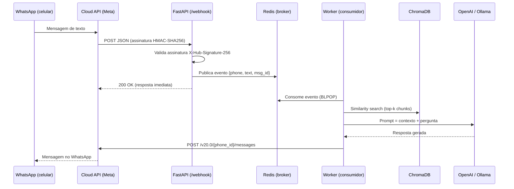

# 🚀 whatsapp-rag-broker


> **PoC de portfólio** — Prova técnica demonstrando integração com a **API Oficial do WhatsApp (Meta Cloud API)**, processamento assíncrono via **Broker (Redis)** e geração de respostas com **RAG (Retrieval-Augmented Generation)**.

---

## 🎯 Business Case

Um assistente de atendimento inteligente B2B integrado via **Webhook oficial da Meta**. O sistema recebe mensagens no WhatsApp, as coloca em fila para processamento assíncrono (desacoplamento real de produção), consulta uma base de conhecimento vetorizada e responde ao usuário com informações fundamentadas em documentos reais — sem alucinação não rastreada.

---

## 🏗️ Arquitetura



---

## 🧱 Tech Stack

| Camada | Tecnologia | Justificativa |
|--------|-----------|---------------|
| API/Webhook | Python 3.11 + FastAPI | Assíncrono nativo, ideal para webhooks de alta volumetria |
| Broker | Redis (LPUSH/BLPOP) | Substituto local do AWS SQS; mesmo padrão de desacoplamento |
| Vector Store | ChromaDB | Zero setup, embeddings locais, substituível por Pinecone/OpenSearch |
| LLM | OpenAI GPT-4o-mini ou Ollama | Flexível: cloud ou self-hosted |
| Segurança | HMAC-SHA256 | Validação de assinatura obrigatória pela Meta (X-Hub-Signature-256) |
| Infra | Docker + docker-compose | Deploy com um comando |
| Testes | Pytest | Unitários no webhook e na lógica RAG |
| CI/CD | GitLab CI | Pipeline de lint + testes |

---

## 📁 Estrutura do Projeto

```
whatsapp-rag-broker/
├── app/
│   ├── main.py              # FastAPI — rotas GET/POST /webhook
│   ├── worker.py            # Consumidor da fila, RAG e envio de resposta
│   ├── rag.py               # Ingestão de documentos + similarity search
│   ├── whatsapp_client.py   # Wrapper para a API de envio da Meta
│   └── security.py          # Validação HMAC-SHA256
├── data/
│   └── docs/                # PDFs ou .txt de exemplo para a base RAG
├── tests/
│   ├── test_webhook.py
│   └── test_rag.py
├── docker-compose.yml
├── Dockerfile
├── .gitlab-ci.yml
├── requirements.txt
├── .env.example
└── README.md
```

---

## 🚀 Como Rodar

### Pré-requisitos
- Docker + Docker Compose instalados
- Conta de desenvolvedor na Meta (app gratuito no [Meta for Developers](https://developers.facebook.com/))
- [Ngrok](https://ngrok.com/) para expor o endpoint local

### 1. Clone e configure
```bash
git clone https://github.com/danzeroum/whatsapp-rag-broker.git
cd whatsapp-rag-broker
cp .env.example .env
# Edite .env com seu META_VERIFY_TOKEN, META_APP_SECRET e OPENAI_API_KEY
```

### 2. Adicione seus documentos
```bash
# Coloque PDFs ou arquivos .txt na pasta data/docs/
# Depois rode a ingestão:
docker-compose run --rm api python -c "from app.rag import ingest_documents; ingest_documents()"
```

### 3. Suba o ambiente
```bash
docker-compose up --build
```

### 4. Exponha via Ngrok
```bash
ngrok http 8000
# Use a URL HTTPS gerada no painel do Meta Developer como Webhook URL
# Callback URL: https://xxxx.ngrok.io/webhook
# Verify Token: o mesmo do seu .env (META_VERIFY_TOKEN)
```

### 5. Teste
Envie uma mensagem para o número de teste da Meta e observe os logs do worker respondendo com base nos seus documentos.

---

## 🔬 How This Demonstrates Senior-Level Skills

> *"Embora a stack seja deliberadamente enxuta para fins de PoC, o projeto simula um cenário real de produção: webhook seguro com validação HMAC (exigência corporativa da Meta), desacoplamento via broker (padrão SQS), RAG auditável com ChromaDB e uma arquitetura stateless pronta para escalar em AWS Lambda + SQS sem refatoração significativa."*

- **Segurança B2B**: Validação `X-Hub-Signature-256` — sem isso, qualquer endpoint pode ser forjado.
- **Desacoplamento real**: O webhook responde `200 OK` em < 50ms para a Meta; o processamento pesado (RAG + LLM) ocorre no worker de forma assíncrona.
- **Substituição por AWS**: `LPUSH/BLPOP` (Redis) → `SQS SendMessage/ReceiveMessage` é uma troca de 5 linhas.
- **RAG auditável**: Cada resposta inclui os chunks fonte recuperados, viabilizando rastreabilidade completa.
- **Testes e CI/CD**: Estrutura pronta para integrar em pipeline de entrega contínua.

---

## 🗺️ Roadmap (Evoluções Planejadas)

- [ ] Substituir Redis por AWS SQS/SNS (produção)
- [ ] Adicionar observabilidade com [Langfuse](https://langfuse.com/) (tracing de tokens e latência)
- [ ] Orquestração multiagente com LangGraph (roteamento de intenções)
- [ ] Suporte a mensagens de áudio (Whisper para transcrição)
- [ ] Deploy no AWS Lambda + API Gateway

---

## 📄 Licença

MIT — use à vontade para fins de estudo e portfólio.
